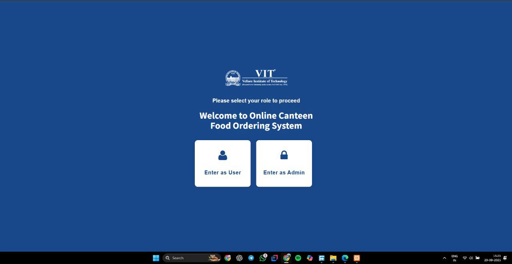
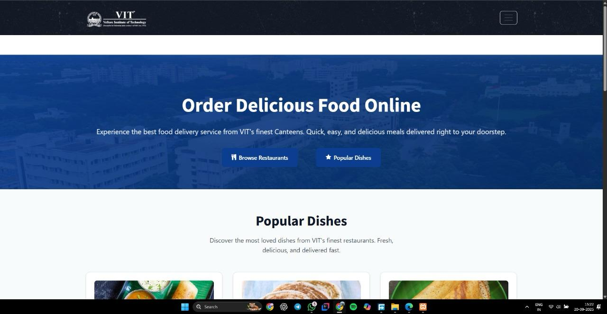
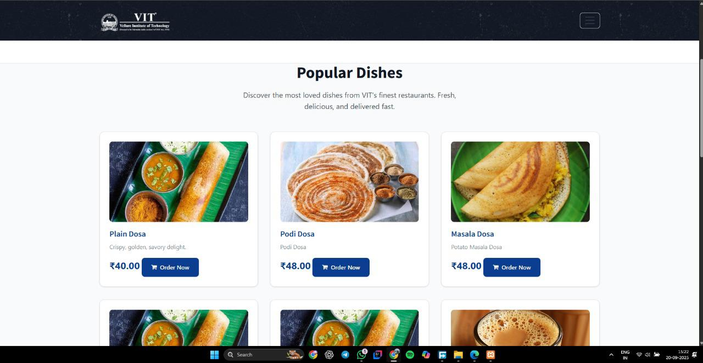
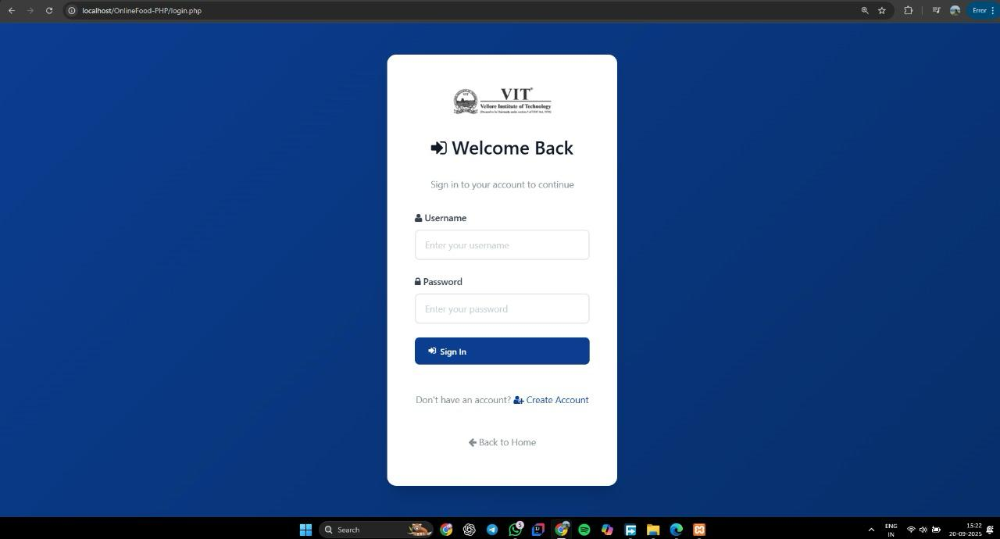
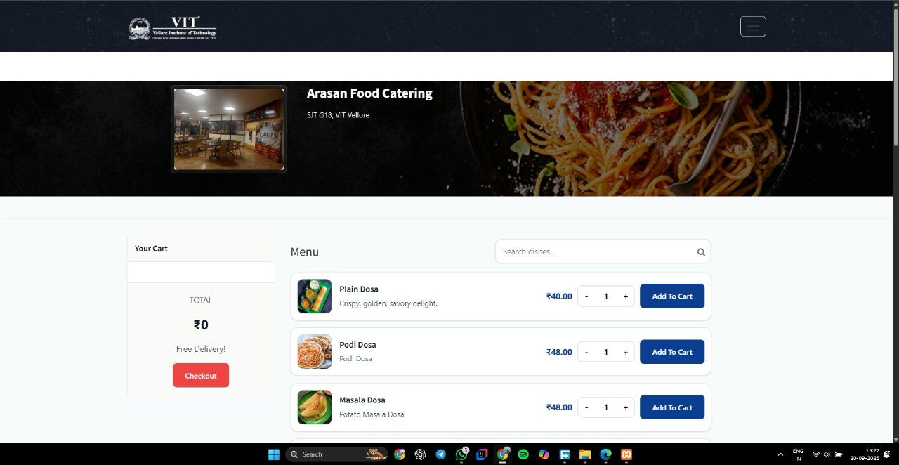
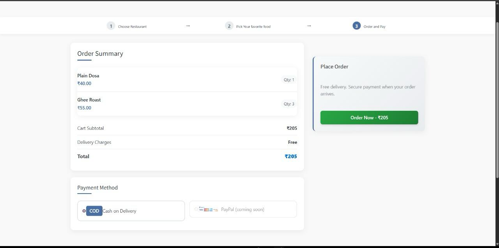
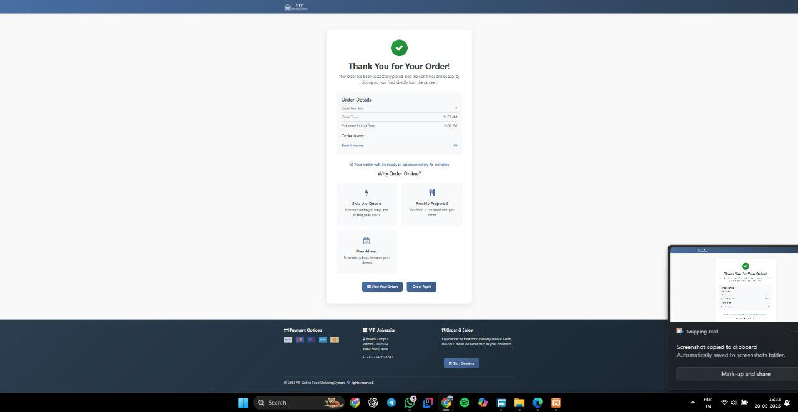

# Campus-Cart

A web application designed to streamline food ordering for students by enabling online menu browsing, ordering, and payment. This system helps reduce cafeteria queues and waiting times, improving overall efficiency.

The frontend is built with HTML and CSS for a clean, responsive interface, while the backend uses PHP for server-side logic and MySQL for database integration. Students can securely place and manage orders in real time, and administrators can track and update food availability seamlessly.

---

## Features

- Online menu browsing  
- Easy order placement and management  
- Secure payment integration  
- Real-time order tracking  
- Admin dashboard for managing menu and orders  
- Responsive design for desktop and mobile devices  

---

## Screenshots

### Initial Page


### Main Page


### Home Page


### Login Page


### Menu Page


### Restaurants


### Payment Page


### Bill Payment



## Tech Stack

| Component | Technology |
|------------|-------------|
| Frontend | HTML, CSS |
| Backend | PHP |
| Database | MySQL |
| Server | XAMPP / Apache |

---

## Installation and Setup

1. Clone the repository:
   ```bash
   git clone git@github.com:yuvashree031/Campus-Cart.git

